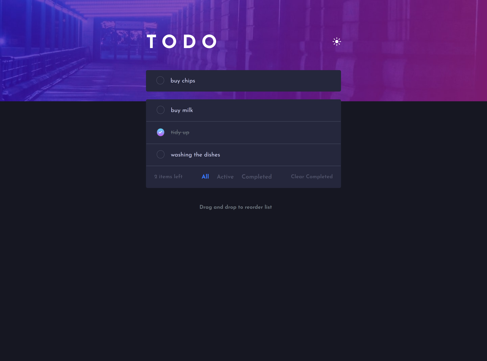
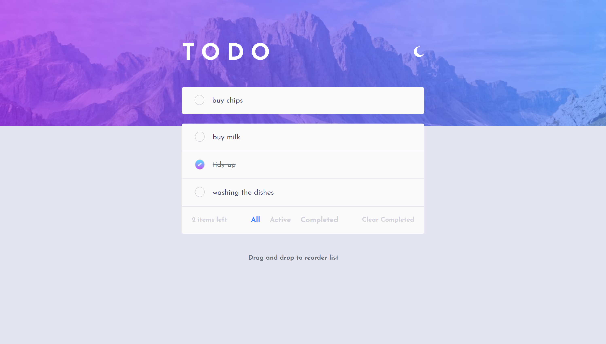
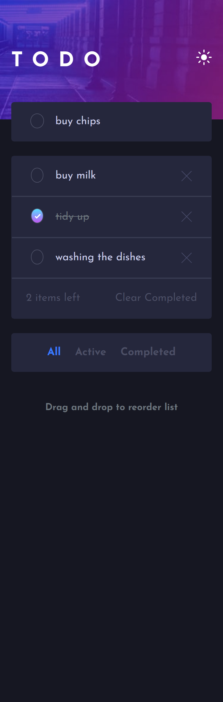
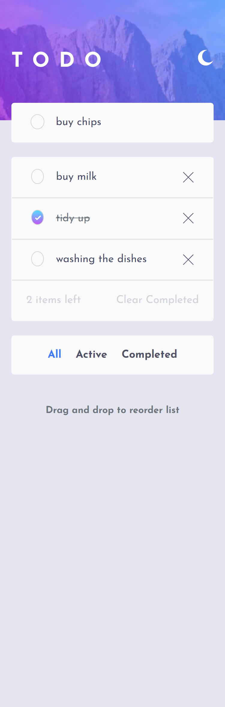

# Frontend Mentor - Todo app Challenge Fullstack Solution

This is my fullstack solution to the [Todo app challenge on Frontend Mentor](https://www.frontendmentor.io/challenges/todo-app-Su1_KokOW). 

## Table of contents

- [Overview](#overview)
  - [Built with](#built-with)
  - [Links](#links)
  - [Screenshot](#screenshot)

## Overview

### Built with

- HTML
- CSS custom properties
- TypeScript
- [Bootstrap](https://getbootstrap.com/)
- [React](https://reactjs.org/)
- [Node.js](https://nodejs.org/en)
- [Express.js](https://expressjs.com/)

### Links

- [Click here to check out the video about the demo!]()

### Screenshot

For more screenshots go to the client -> public folder

-Desktop:

-Mobile:

